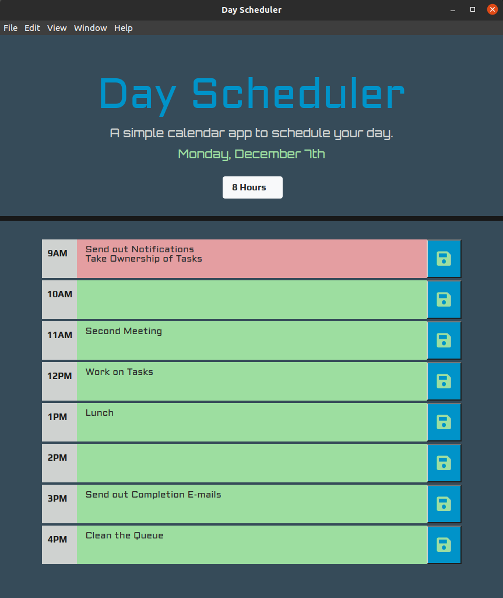

# Scheduler

> Day Scheduler Concept using jQuery/JS/HTML/CSS.  

- [x] [Initital App](https://github.com/MBrassey/Scheduler/issues/1)
- [x] [Functionality](https://github.com/MBrassey/Scheduler/issues/2)
- [x] [Style & Fonts](https://github.com/MBrassey/Scheduler/issues/3)
- [x] [Touch Ups](https://github.com/MBrassey/Scheduler/issues/4)
<h6>
[ Click the below image to view the <a href="https://MBrassey.github.io/Scheduler/">webapplication</a> ]
</h6>

[
](https://MBrassey.github.io/Scheduler/)