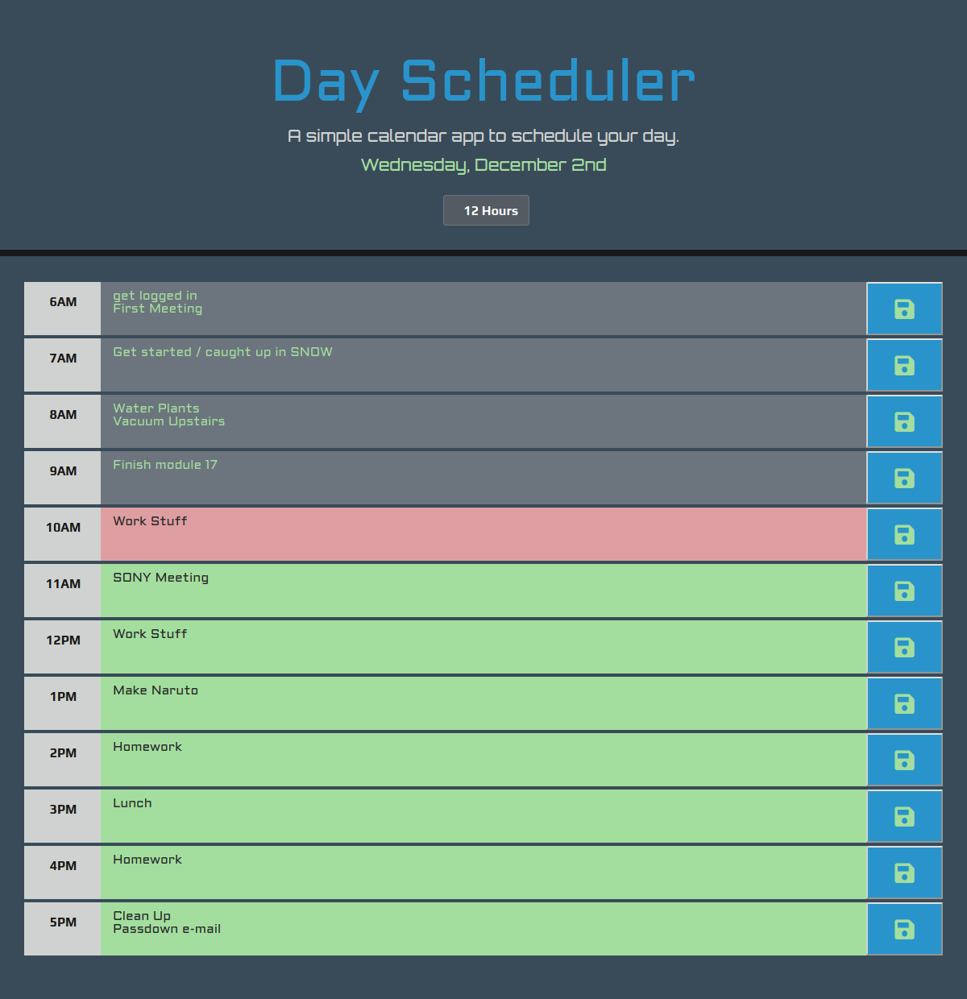

## Scheduler

Day scheduler concept using jQuery/JS/HTML/CSS, packaged by @electron-forge for Windows, Mac & Linux.

#### Issues

- [x] [Initital App](https://github.com/MBrassey/Scheduler/issues/1)
- [x] [Functionality](https://github.com/MBrassey/Scheduler/issues/2)
- [x] [Style & Fonts](https://github.com/MBrassey/Scheduler/issues/3)
- [x] [Touch Ups](https://github.com/MBrassey/Scheduler/issues/4)

#### Download

[Releases](https://github.com/MBrassey/Scheduler-Electron/releases)

<h6>
:cyclone: Click the image below to view the live <a id="Screenshots" href="https://MBrassey.github.io/Scheduler/">webapplication</a>
</h6>

[
](https://MBrassey.github.io/Scheduler/)

#### Questions

Contact me at [matt@brassey.io](mailto:matt@brassey.io) with any questions or comments.

#### License

`Scheduler` is published under the **CC0_1.0_Universal** license.

> The Creative Commons CC0 Public Domain Dedication waives copyright interest in a work you've created and dedicates it to the world-wide public domain. Use CC0 to opt out of copyright entirely and ensure your work has the widest reach. As with the Unlicense and typical software licenses, CC0 disclaims warranties. CC0 is very similar to the Unlicense.
